# Force Recorder — Architecture Design Document

**Version:** 1.1  
**Date:** 2026-04-27  
**Author:** Derek Liew

---

## Table of Contents

1. [System Overview](#1-system-overview)
2. [Technology Stack](#2-technology-stack)
3. [High-Level Architecture](#3-high-level-architecture)
4. [Component Architecture](#4-component-architecture)
5. [State Management](#5-state-management)
6. [Data Flow — Force Measurement Pipeline](#6-data-flow--force-measurement-pipeline)
7. [Data Flow — Authentication & Persistence](#7-data-flow--authentication--persistence)
8. [Service Layer](#8-service-layer)
9. [Bluetooth Protocol](#9-bluetooth-protocol)
10. [Google Sheets Schema](#10-google-sheets-schema)
11. [Security Architecture](#11-security-architecture)
12. [Deployment Architecture](#12-deployment-architecture)
13. [Key Design Decisions](#13-key-design-decisions)
14. [Module Dependency Graph](#14-module-dependency-graph)
15. [Render Optimization Strategy](#15-render-optimization-strategy)
16. [Error Handling & Resilience](#16-error-handling--resilience)
17. [Force Conversion Math](#17-force-conversion-math)
18. [Theme System](#18-theme-system)
19. [Sequence — Tare Operation](#19-sequence--tare-operation)
20. [Sequence — Person History Load](#20-sequence--person-history-load)
21. [Environment & Configuration Reference](#21-environment--configuration-reference)
22. [Browser Compatibility](#22-browser-compatibility)
23. [Potential Future Architecture](#23-potential-future-architecture)

---

## 1. System Overview

Force Recorder is a browser-based single-page application for recording and tracking strength testing data from the **Tindeq Progressor** dynamometer. It connects to the device over **Web Bluetooth**, captures live force readings, and persists test results to **Google Sheets** for longitudinal tracking.

**Core capabilities:**

- Real-time force measurement via BLE at ~100 Hz
- Per-person historical tracking with chart visualization
- Google OAuth authentication gating persistence
- Unit conversion (Newtons / lbs / kg)
- Dark mode, offline-compatible UI
- Guided PIMA training sessions with live force graphing and orange/green rep-state feedback

**Design principles:**

- Zero backend — all logic runs client-side
- Stateless service singletons — easy to call anywhere
- Reactive UI via Zustand stores — components subscribe only to what they need
- Browser-standard APIs only (Web Bluetooth, Fetch, OAuth)

---

## 2. Technology Stack

| Layer | Technology | Version | Purpose |
|-------|-----------|---------|---------|
| UI Framework | React | 18.3.1 | Component rendering, lifecycle |
| Language | TypeScript | 5.5.3 | Type safety across all layers |
| State | Zustand | 4.5.2 | Lightweight reactive stores |
| Charts | Recharts | 3.8.1 | Historical force line charts |
| Auth | @react-oauth/google | 0.12.1 | Google OAuth 2.0 PKCE flow |
| HTTP | Axios | 1.15.0 | Google userinfo endpoint |
| Dates | date-fns | 3.3.1 | ISO 8601 timestamp formatting |
| Icons | lucide-react | 0.344.0 | UI iconography |
| Styling | Tailwind CSS | 3.4.1 | Utility-first CSS |
| Build | Vite | 8.0.8 | ES module bundler, HMR |
| Hardware | Web Bluetooth API | Browser | BLE device communication |
| Storage | Google Sheets REST v4 | - | Remote data persistence |

---

## 3. High-Level Architecture

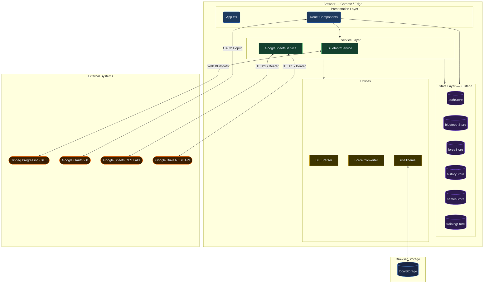

---

## 4. Component Architecture

### 4.1 Component Tree

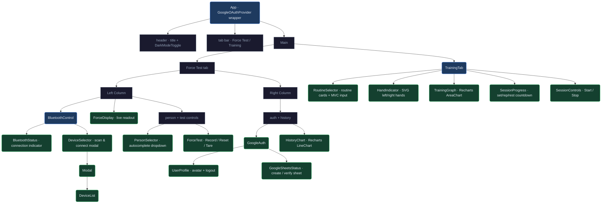

### 4.2 Component Responsibilities

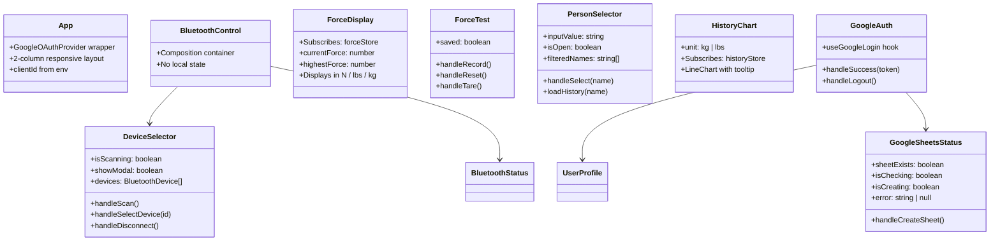

---

## 5. State Management

Six independent Zustand stores. Each component subscribes only to the slice it needs, preventing unnecessary re-renders.

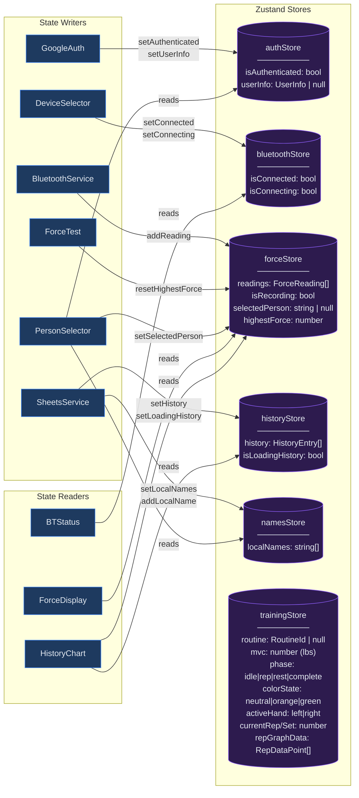

### 5.1 Store Interaction Matrix

| Store | Written By | Read By | Persistence |
|-------|-----------|---------|-------------|
| `authStore` | GoogleAuth | PersonSelector, SheetsStatus, ForceTest | None (session) |
| `bluetoothStore` | DeviceSelector | BluetoothStatus, DeviceSelector | None (session) |
| `forceStore` | BluetoothService, ForceTest, PersonSelector | ForceDisplay, ForceTest, HistoryChart, trainingStore subscriber | None (session) |
| `historyStore` | GoogleSheetsService | HistoryChart | Remote (Sheets) |
| `namesStore` | GoogleSheetsService | PersonSelector | Remote (Sheets) |
| `trainingStore` | trainingStore subscriber (forceStore), SessionControls, RoutineSelector | TrainingTab, TrainingGraph, SessionProgress, HandIndicator, SessionControls | None (session) |

---

## 6. Data Flow — Force Measurement Pipeline

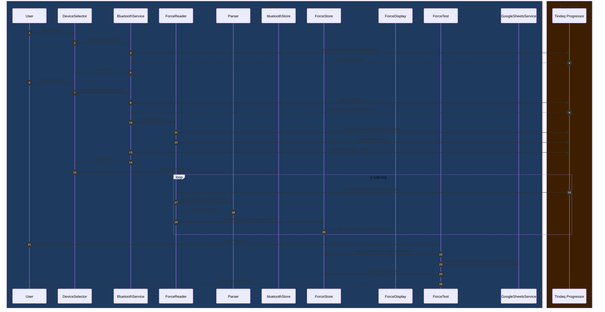

### 6.1 BLE Data Parsing Detail

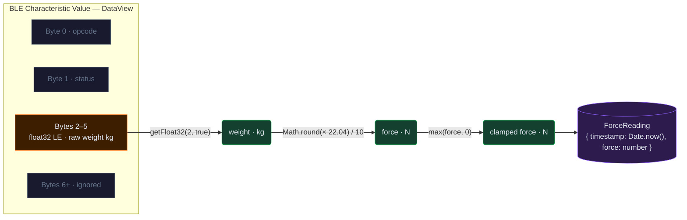

---

## 7. Data Flow — Authentication & Persistence

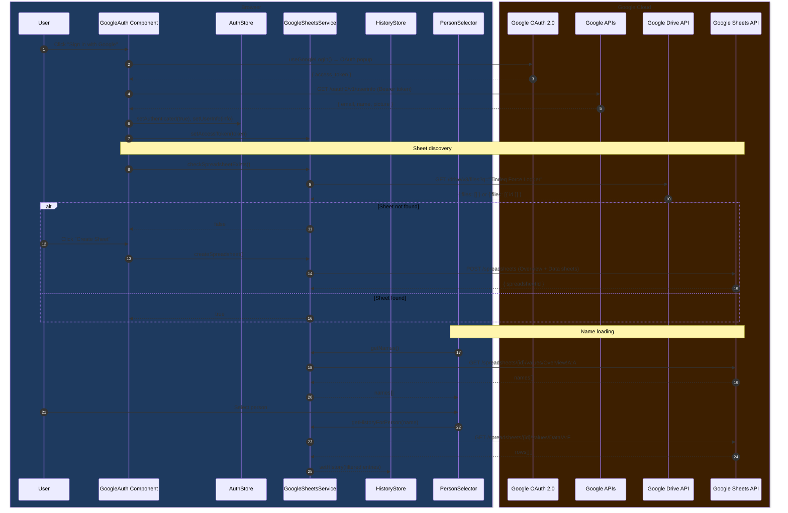

---

## 8. Service Layer

### 8.1 BluetoothService Architecture

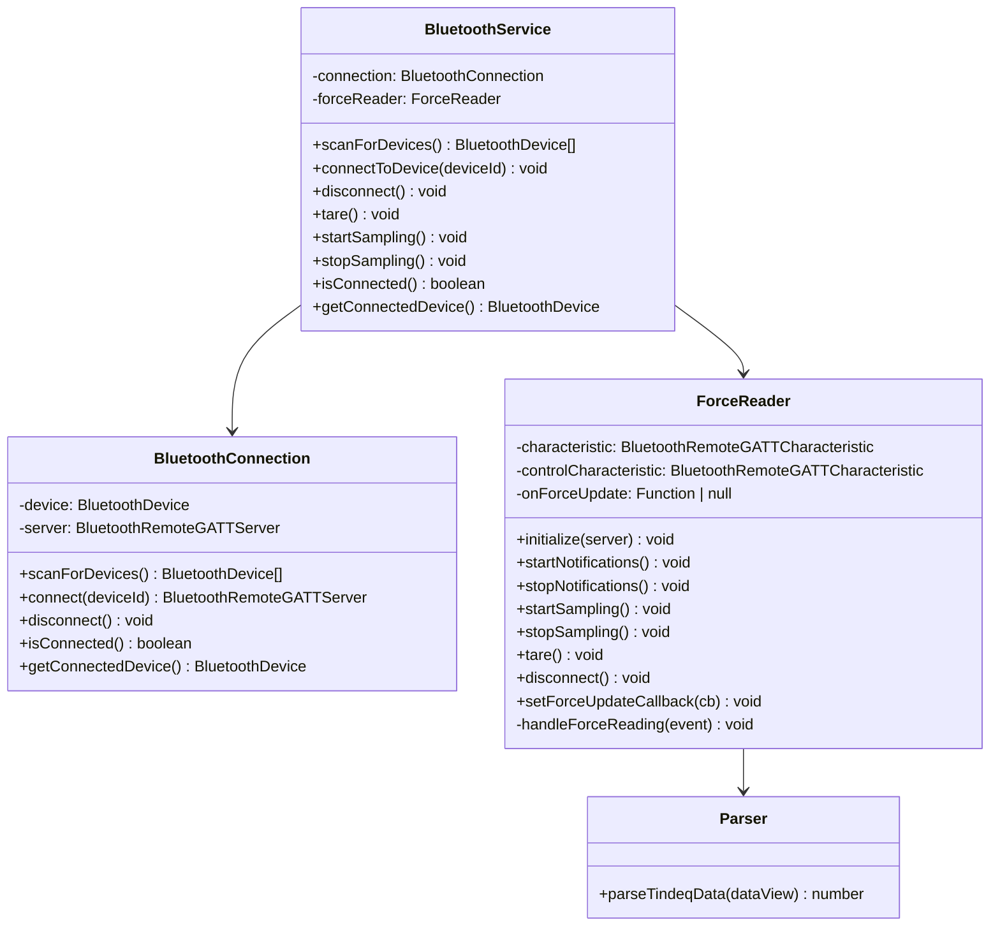

### 8.2 GoogleSheetsService Architecture

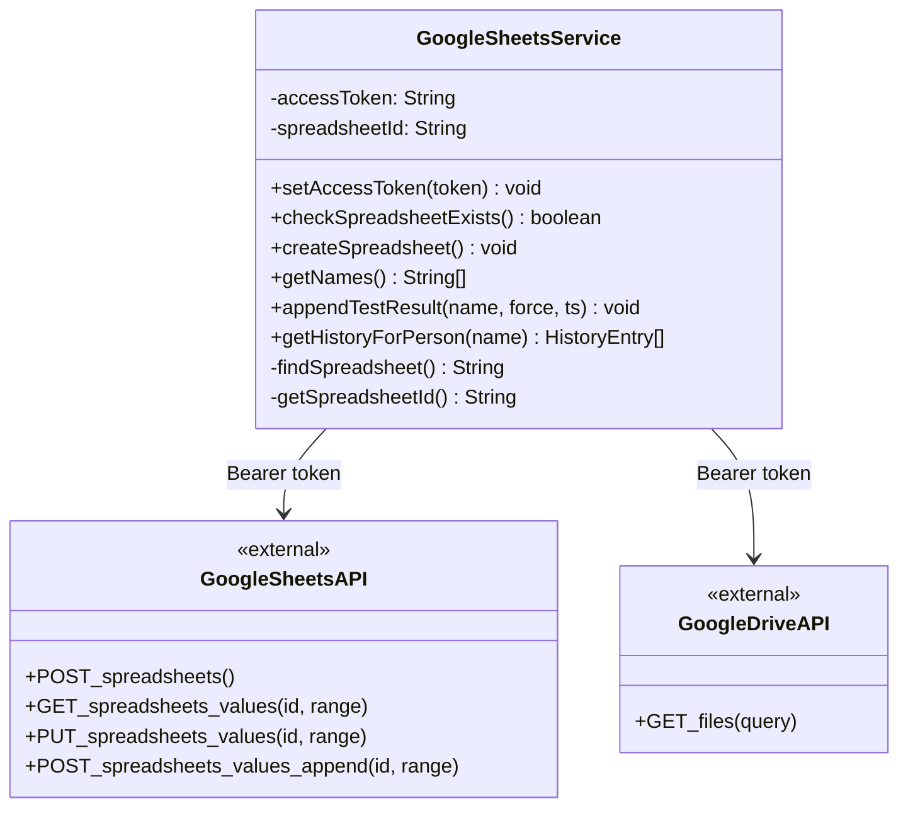

---

## 9. Bluetooth Protocol

### 9.1 BLE Service & Characteristic Map

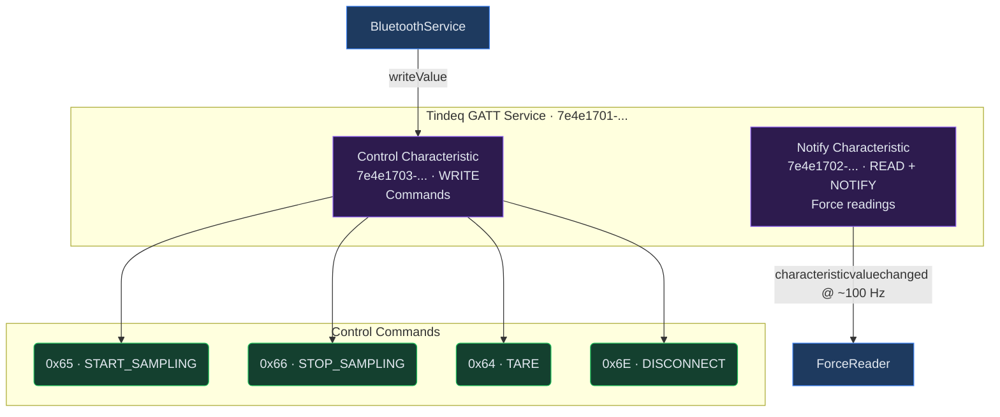

### 9.2 Connection State Machine

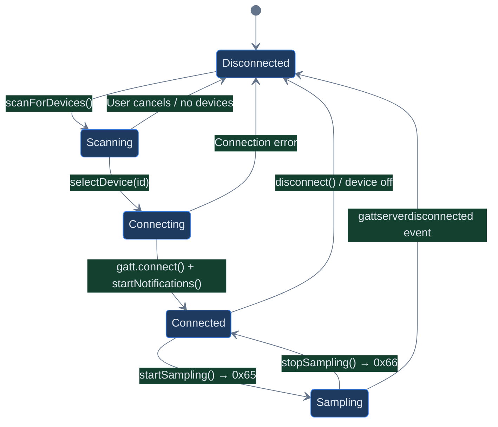

---

## 10. Google Sheets Schema

### 10.1 Spreadsheet Structure

```
Spreadsheet: "Tindeq Force Logger"
├── Sheet: "Data"           (append-only test results)
│   ├── A1: Timestamp
│   ├── B1: Name
│   ├── C1: Force (N)
│   ├── D1: Force (lbs)
│   ├── E1: Force (kg)
│   └── F1: Notes
│
└── Sheet: "Overview"       (derived aggregates)
    ├── A1: Names
    └── A2: =UNIQUE(Data!B2:B)   ← Google Sheets formula
```

### 10.2 Data Flow to Sheets

```mermaid
flowchart LR
    ForceTest("ForceTest") -->|"name, highestForce, Date.now()"| AppendFn

    subgraph AppendFn["appendTestResult()"]
        TS["format(ts, 'yyyy-MM-dd HH:mm:ss')"]
        Conv["convertForce(N)<br/>→ { lbs, kg }"]
        Row["[ timestamp, name, N, lbs, kg, '' ]"]
    end

    AppendFn -->|"POST :append · Data!A:F"| SheetsAPI[("Google Sheets API")]
    SheetsAPI -->|"UNIQUE formula auto-updates"| Overview[("Overview!A2:A<br/>names list")]
    Overview -->|"getNames()"| PersonSelector("PersonSelector")

    classDef component fill:#1e3a5f,stroke:#3b82f6,color:#e2e8f0
    classDef fn fill:#14402f,stroke:#22c55e,color:#e2e8f0
    classDef external fill:#3d1f00,stroke:#f97316,color:#e2e8f0

    class ForceTest,PersonSelector component
    class TS,Conv,Row fn
    class SheetsAPI,Overview external
```

---

## 11. Security Architecture

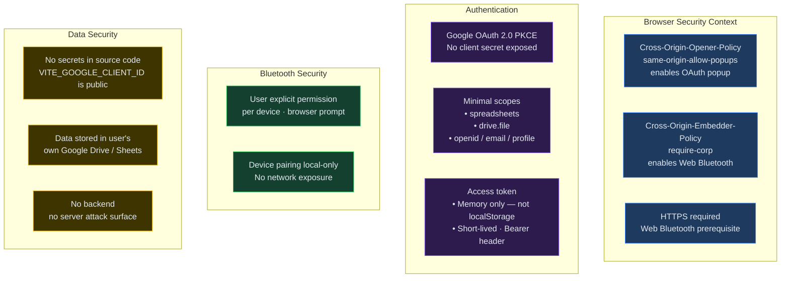

---

## 12. Deployment Architecture

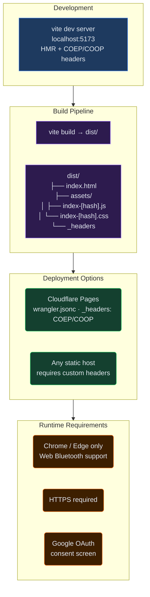

### 12.1 Required HTTP Headers (Production)

The `_headers` file (Cloudflare Pages) and `vite.config.ts` (dev) both configure:

```
Cross-Origin-Opener-Policy: same-origin-allow-popups
Cross-Origin-Embedder-Policy: require-corp
```

These are mandatory — without them, either the OAuth popup is blocked or Web Bluetooth is unavailable.

---

## 13. Key Design Decisions

### 13.1 No Backend Server

**Decision:** All business logic runs client-side; Google APIs are called directly from the browser.

**Rationale:**
- Eliminates infrastructure cost and complexity
- User data goes directly to their own Google Drive — no third-party storage
- OAuth tokens never touch a server
- Acceptable because the only integrations are Google APIs (browser-friendly CORS)

**Trade-offs:**
- Token refresh must happen client-side (no server-side token management)
- No server-side caching — every person switch fetches the full Sheets data

---

### 13.2 Zustand over Redux / Context

**Decision:** Five independent Zustand stores, one per domain.

**Rationale:**
- Zustand is ~2 KB; no reducers, actions, or dispatch boilerplate
- Independent stores prevent cross-domain re-renders
- Easy to subscribe to a single field: `useForceStore(s => s.highestForce)`
- Direct mutation pattern matches the imperative BLE callback style

**Trade-offs:**
- No time-travel debugging (no Redux DevTools)
- No enforced action log

---

### 13.3 Google Sheets as Database

**Decision:** Google Sheets is the sole persistence layer.

**Rationale:**
- Users already have Google accounts
- Zero database setup — sheet is auto-created on first login
- Data is human-readable and exportable by default
- `=UNIQUE(Data!B2:B)` formula handles deduplication automatically

**Trade-offs:**
- API rate limits (reads count against quota)
- No real-time sync — history loads per person switch, not continuously
- All test results loaded into memory for filtering (no server-side query)

---

### 13.4 Service Singletons

**Decision:** `bluetoothService` and `googleSheetsService` are module-level singletons.

**Rationale:**
- BLE and OAuth connections are inherently singleton resources
- Avoids prop-drilling service instances through the component tree
- State derived from services lives in Zustand stores (testable separately)

**Trade-offs:**
- Harder to unit test (global mutable state)
- Cannot have multiple simultaneous BLE connections (not needed)

---

### 13.5 COEP/COOP Header Requirement

**Decision:** Configure both `Cross-Origin-Opener-Policy` and `Cross-Origin-Embedder-Policy` headers.

**Rationale:**
- `COEP: require-corp` is required to access shared memory APIs and is implicitly needed for Web Bluetooth in some browser configurations
- `COOP: same-origin-allow-popups` allows the Google OAuth popup to communicate back to the opener window
- These two headers together satisfy both BLE and OAuth requirements without relaxing security meaningfully

**Trade-offs:**
- Restricts loading third-party resources without `Cross-Origin-Resource-Policy` headers (not an issue since no external assets are loaded)

---

## 14. Module Dependency Graph

How modules import each other — arrows point from importer to dependency.

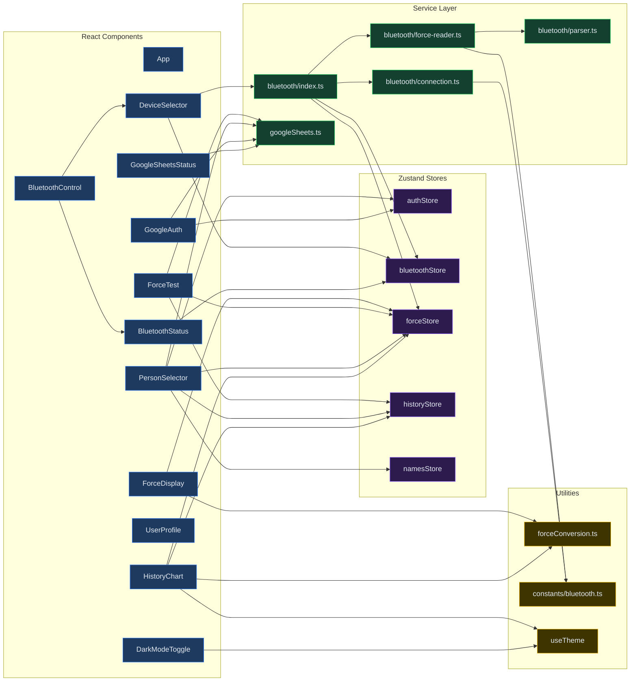

---

## 15. Render Optimization Strategy

### 15.1 Why components don't over-render

Each component subscribes to the **minimum slice** of state needed via Zustand selectors. Zustand uses shallow equality by default — a component only re-renders when its subscribed value actually changes.

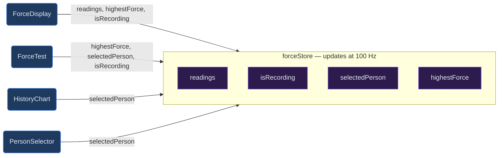

- `ForceDisplay` uses a single multi-field selector — re-renders on every reading (intentional: displays live data)
- `HistoryChart` subscribes only to `selectedPerson` — unaffected by the 100 Hz reading stream
- `ForceTest` re-renders only when `highestForce` or `selectedPerson` changes

### 15.2 High-frequency data path

At ~100 Hz, `forceStore.addReading()` fires continuously while sampling. Only `ForceDisplay` is subscribed to `readings` — all other components subscribe to derived values (`highestForce`, `selectedPerson`) that change far less frequently.

```
BLE event @ 100Hz
  → forceStore.addReading()          ← Zustand setState
  → ForceDisplay re-render           ← subscribed to readings[]
  → highestForce updated (if new max)
    → ForceTest re-render            ← subscribed to highestForce
```

---

## 16. Error Handling & Resilience

### 16.1 Error state map

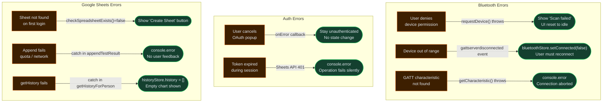

### 16.2 Known resilience gaps

| Scenario | Current Behavior | Recommended Improvement |
|----------|-----------------|------------------------|
| Sheets API 401 (expired token) | Silent fail | Prompt re-authentication |
| `appendTestResult` network error | Silent fail | Toast error + retry queue |
| BLE disconnect during recording | Force data stops, no alert | Detect disconnect, warn user |
| No names in sheet yet | Empty dropdown | Show "No people yet — type a new name" |

---

## 17. Force Conversion Math

### 17.1 Raw BLE → display units pipeline

```
DataView (bytes 2–5, little-endian float32)
  = weight in raw sensor units (approximately kg)

Math.round(weight × 22.04) / 10 = force in Newtons
  ↓
  N × 0.101972 = force in kg (body-weight equivalent)
  N × 0.224809 = force in lbs
```

### 17.2 Conversion factor origin

The Tindeq Progressor outputs a float where the unit approximates kilograms of load. The expression `Math.round(weight × 22.04) / 10` multiplies by ~2.204 (kg→lbs factor) and rounds to one decimal place of precision in Newtons. This is specific to the Tindeq protocol and not a standard SI conversion.

The display/persistence conversions use reciprocal multiplication rather than division: `0.101972 ≈ 1/9.80665` and `0.224809 ≈ 1/4.44822`.

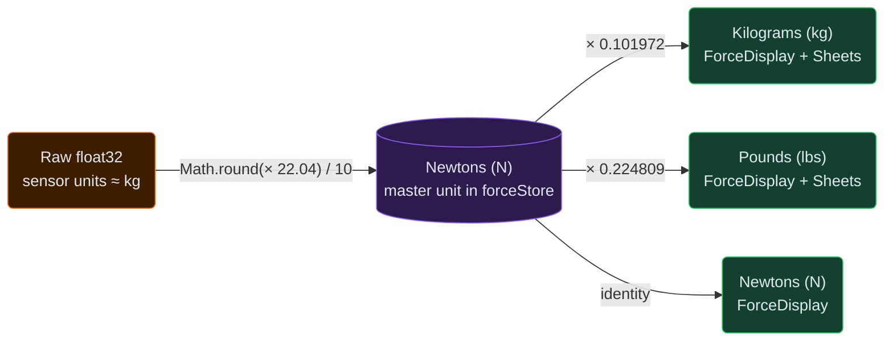

All intermediate values are discarded — only Newtons are stored in `forceStore`. Conversions happen at render time in `ForceDisplay` and at save time in `appendTestResult`.

---

## 18. Theme System

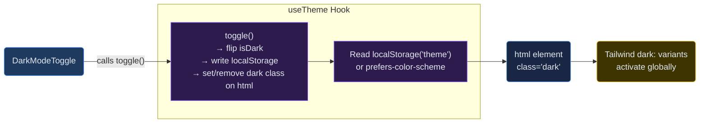

- Theme is persisted in `localStorage` under key `'theme'`
- Tailwind's `darkMode: 'class'` strategy — all `dark:` variants key off the `<html>` element's class
- `useTheme` is the only custom hook in the codebase; it wraps an internal Zustand store (`useThemeStore`) not exported alongside the five domain stores

---

## 19. Sequence — Tare Operation

The tare operation zeroes the force sensor, compensating for equipment weight (e.g., harness, rope).

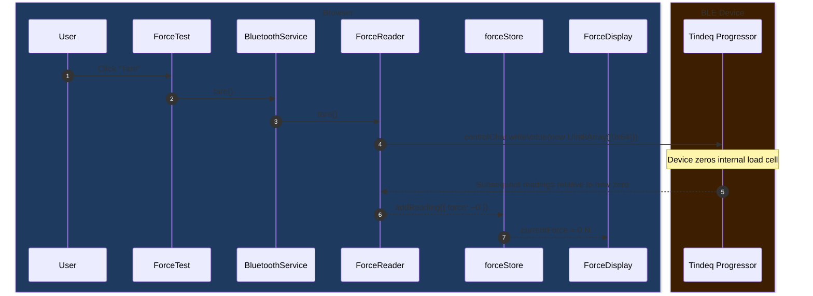

---

## 20. Sequence — Person History Load

```mermaid
sequenceDiagram
    autonumber
    box rgb(30,58,95) Browser
    participant User
    participant PersonSelector
    participant forceStore
    participant historyStore
    participant SheetsService as GoogleSheetsService
    participant HistoryChart
    end
    box rgb(61,31,0) Google Cloud
    participant SheetsAPI as Google Sheets API
    end

    User->>PersonSelector: Select "Alice" from dropdown
    PersonSelector->>forceStore: setSelectedPerson("Alice")
    PersonSelector->>historyStore: setLoadingHistory(true)
    PersonSelector->>SheetsService: getHistoryForPerson("Alice")
    SheetsService->>SheetsAPI: GET /values/Data!A:F
    SheetsAPI-->>SheetsService: All rows (entire Data sheet)
    Note over SheetsService: Filter rows where col B === "Alice"
    Note over SheetsService: Map to HistoryEntry[], sort by timestamp
    SheetsService-->>historyStore: setHistory(aliceEntries)
    historyStore-->>PersonSelector: isLoadingHistory = false
    historyStore-->>HistoryChart: re-render with Alice's data
```

---

## 21. Environment & Configuration Reference

| Variable | Location | Purpose |
|----------|----------|---------|
| `VITE_GOOGLE_CLIENT_ID` | `.env` | Google OAuth client ID (public, per-project) |
| `COOP` header | `vite.config.ts` + `_headers` | Enables OAuth popup return |
| `COEP` header | `vite.config.ts` + `_headers` | Required for Web Bluetooth + shared memory |
| `wrangler.jsonc` | Project root | Cloudflare Pages deployment config |
| `tailwind.config.js` | Project root | `darkMode: 'class'` strategy |
| `tsconfig.app.json` | Project root | `strict: true`, `target: ES2020` |

---

## 22. Browser Compatibility

| Feature | Chrome | Edge | Firefox | Safari |
|---------|--------|------|---------|--------|
| Web Bluetooth | ✅ | ✅ | ❌ | ❌ |
| Google OAuth popup | ✅ | ✅ | ✅ | ✅ |
| ES2020 modules | ✅ | ✅ | ✅ | ✅ |
| CSS `@layer` (Tailwind) | ✅ | ✅ | ✅ | ✅ |
| **Overall** | **✅ Full** | **✅ Full** | **❌ No BLE** | **❌ No BLE** |

The app is functionally blocked on Firefox and Safari due to their lack of Web Bluetooth API support. A "browser not supported" guard at the `App` level would improve the user experience for those visitors.

---

## 23. Potential Future Architecture

These are not planned changes — they document logical extension points if requirements grow.

### 23.1 Offline / PWA support

```mermaid
graph LR
    SW("Service Worker · Workbox") -->|"cache static assets"| Offline("Offline UI load")
    IDB("IndexedDB · idb-keyval") -->|"buffer readings<br/>when network down"| Queue("Sync queue")
    Queue -->|"flush on reconnect"| SheetsService("GoogleSheetsService")

    classDef future fill:#2d1b4e,stroke:#8b5cf6,color:#e2e8f0
    classDef storage fill:#1a2744,stroke:#60a5fa,color:#e2e8f0
    classDef svc fill:#14402f,stroke:#22c55e,color:#e2e8f0

    class SW,Queue future
    class IDB,Offline storage
    class SheetsService svc
```

### 23.2 Multi-device / multi-user scaling

```mermaid
graph LR
    CloudFn("Cloud Function<br/>optional backend") -->|"token refresh<br/>batch writes"| SheetsAPI("Google Sheets API")
    Supabase("Supabase / PlanetScale<br/>alternative DB") -->|"real-time sync<br/>multi-user"| App("App")
    App -->|"currently direct"| SheetsAPI

    classDef future fill:#2d1b4e,stroke:#8b5cf6,color:#e2e8f0
    classDef external fill:#3d1f00,stroke:#f97316,color:#e2e8f0
    classDef current fill:#1e3a5f,stroke:#3b82f6,color:#e2e8f0

    class CloudFn,Supabase future
    class SheetsAPI external
    class App current
```

### 23.3 BLE reconnection

Currently the app requires manual reconnection if the device drops. An auto-reconnect loop using the cached device reference from `navigator.bluetooth.getDevices()` could be added to `BluetoothConnection` without changing the store or UI contract.

---

*End of Architecture Design Document*
