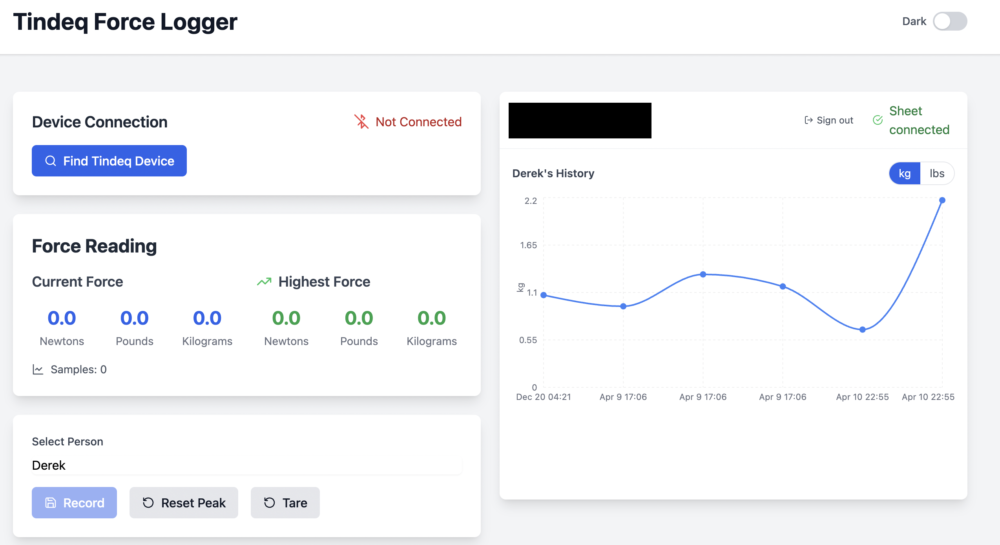
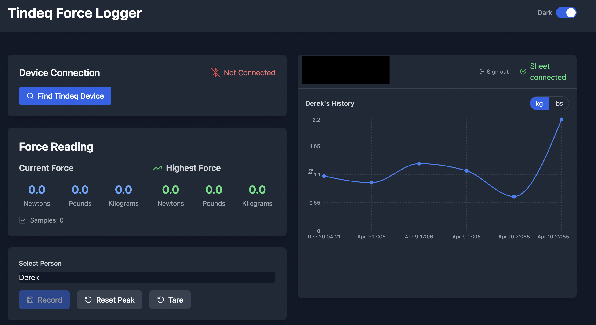

# Tindeq Force Logger

A web application for logging and tracking force measurements from Tindeq Progressor devices. Connects to Tindeq Progressor dynamometers via Web Bluetooth, records force measurements, and stores data in Google Sheets.

## Screenshots

| Light Mode | Dark Mode |
|---|---|
|  |  |

## Features

- Bluetooth connection to Tindeq Progressor devices
- Real-time force measurements display (N, lbs, kg)
- Automatic force plateau detection
- Google Sheets integration for data logging
- Multi-user support with profile management
- Test history with chart visualization
- Dark mode support

## Technology Stack

- **Frontend**: React with TypeScript
- **Styling**: Tailwind CSS
- **State Management**: Zustand
- **Authentication**: Google OAuth (`@react-oauth/google`)
- **APIs**: Web Bluetooth API, Google Sheets REST API
- **Build Tool**: Vite

## Usage

1. **Connect Device** — Click "Find Tindeq Device", select your Progressor from the list, wait for connection confirmation (Chrome/Edge only)

2. **Google Authentication** — Sign in with your Google account; the app creates a spreadsheet named "Tindeq Force Logger"

3. **Record Measurements** — Select a person, click "Start Test", apply force; the test stops automatically when a plateau is detected

4. **View History** — Past test results are charted per person in the history view

## Project Structure

```
src/
├── components/
│   ├── bluetooth/          # DeviceSelector, DeviceList
│   ├── ui/                 # Button, Modal
│   ├── App.tsx             # Top-level layout
│   ├── BluetoothControl.tsx
│   ├── BluetoothStatus.tsx
│   ├── DarkModeToggle.tsx
│   ├── ForceDisplay.tsx    # Live force readout
│   ├── ForceTest.tsx       # Test flow orchestration
│   ├── GoogleAuth.tsx
│   ├── GoogleSheetsStatus.tsx
│   ├── HistoryChart.tsx
│   ├── PersonSelector.tsx
│   └── UserProfile.tsx
├── services/
│   ├── bluetooth/          # connection.ts, force-reader.ts, parser.ts, index.ts
│   └── googleSheets.ts
├── store/
│   ├── authStore.ts        # Google OAuth state
│   ├── bluetoothStore.ts   # BLE connection state
│   ├── forceStore.ts       # Active readings, recording state
│   ├── historyStore.ts     # Past test results
│   └── namesStore.ts       # Profile/person management
├── hooks/
│   └── useTheme.ts
├── utils/
│   └── forceConversion.ts  # N / lbs / kg conversions
└── constants/
    └── bluetooth.ts        # BLE UUIDs and command bytes
```

## Environment

Requires a `.env` file with:

```
VITE_GOOGLE_CLIENT_ID=your_google_client_id_here
```

Web Bluetooth requires Chrome or Edge. The Vite config sets `Cross-Origin-Opener-Policy` and `Cross-Origin-Embedder-Policy` headers required for the Google OAuth popup flow alongside Bluetooth.
